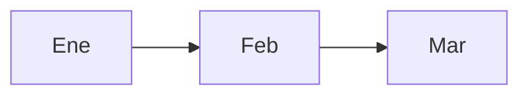

# Exportación del informe a HTML / PDF

## Generar HTML

Desde la raíz del repo:

```bash
npm run informe:html
```

Salida por defecto: `informes/dist/informe-equipo-ene-mar-2026.html`.

Otro archivo:

```bash
node scripts/informe-md-to-html.mjs --input informes/otro.md --output informes/dist/otro.html
```

- **`--no-mermaid`**: no carga el script de Mermaid (útil offline o PDF sin gráficos vectoriales).

El generador **elimina el bloque “Índice” manual** del Markdown y crea un **índice enlazable** automático (h2 y h3).

## Guardar como PDF

1. Abre el `.html` en **Chrome** o **Edge**.
2. **Ctrl+P** → destino **Guardar como PDF**.
3. Activa **Más ajustes → Gráficos de fondo** para conservar colores de cabeceras de tabla y bloques destacados.

Los enlaces del índice suelen seguir funcionando en el PDF según el visor.

## Colores y tablas

Estilos en `informe-print.css` (variables `:root` al inicio: acentos, cabeceras de tabla, rayas). Ajusta ahí la paleta sin tocar el script.

## Gráficos

### Mermaid (diagramas / barras simples)

En el `.md`, añade un bloque:

````markdown

````

Regenera el HTML y abre en el navegador; Mermaid se resuelve por CDN. Al imprimir a PDF, espera un segundo a que se dibuje antes de **Imprimir**.

### Gráficos de datos (líneas, barras)

Opciones prácticas:

- Exportar imagen desde Excel / Sheets y colocarla en Markdown: ``.
- O añadir en el futuro un paso con **Chart.js** en un HTML aparte si hace falta interactividad.

## Alternativa: Pandoc + LaTeX

Si prefieres PDF “editorial” con plantilla propia, se puede usar Pandoc (`--toc`, plantilla Eisvogel, etc.); este repo no lo incluye para no depender de LaTeX instalado.
